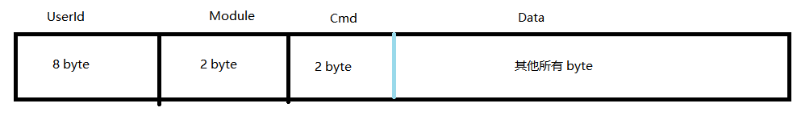

### 消息结构

* UserId 是用户的 Id 类型是 uint64
* Module 把 enum Module 的值转为 uint16 反之也是如此
* Cmd 把每个 enum Module 对应的 enum cmd 的值转为 uint16 反之也是如此
* Data 是除去 12 byte 以后对应的 proto 的 msg

> 注：UserId, Module, Cmd 是小端解析